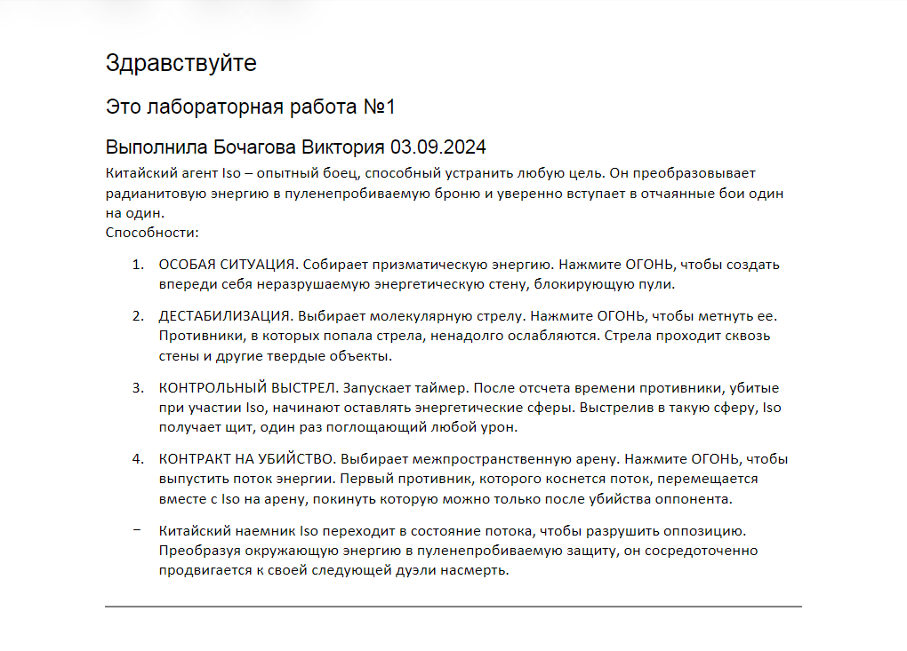
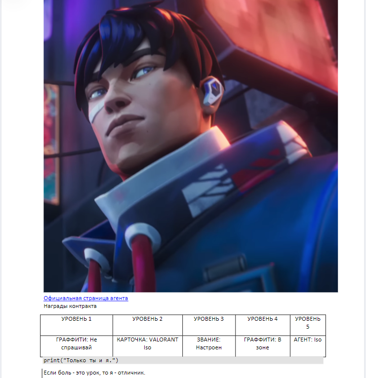

## Министерство науки и высшего образования Российской Федерации
## Федеральное государственное бюджетное образовательное учреждение высшего образования
## «Владимирский государственный университет имени Александра Григорьевича и Николая Григорьевича Столетовых» (ВлГУ)
## Колледж инновационных технологий и предпринимательства
### Лабораторная работа №1
### по дисциплине "Инструментальные средства разработки программного обеспечения"
### по теме "Markdown"
#### Выполнила Бочагова Виктория. 03.09.24. Вариант 2.

Цель работы: изучить основы работы с языком разметки Markdown, научится создавать и форматировать текстовые документы.

Оборудование: компьютер с установленным текстовым редактором, поддерживающим Markdown.

Ход работы:

1. Был создан файл report1.md для выполнения общего задания.
2. В файл были добавлены:
- Заголовки (уровня от 1 до 3)
- Абзацы текста
- Списки (нумерованные и ненумерованные)
- Вставлено изображение
- Вставлена ссылка
- Создана таблица
- Вставлен код
- Написана цитата
- Сделана горизонтальная линия
3. На рисунке 1-2 предоставлены скриншоты готового файла.

Рисунок 1 - Готовый файл

Рисунок 2 - Готовый файл
4. После был создан файл report3.md для выполнения индивидуального задания.
5. В файл были добавлены:
- Математическая формула для вычисления площади круга.
- Диаграмма классов с mermaid для простой системы.
- Встроенный HTML для отправки комментария.
- Сложная таблица с выравниванием текста для списка студентов.
- Галерея изображений с тремя фото городов.
- Вложенные списки с планом проекта с подзадачами.
- Блоки когда на Java и C++.
- Цитата Стива Джобса.
- Таблица содержания.
- Эмодзи для обозначения важной информации.

