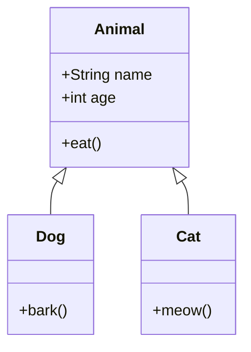
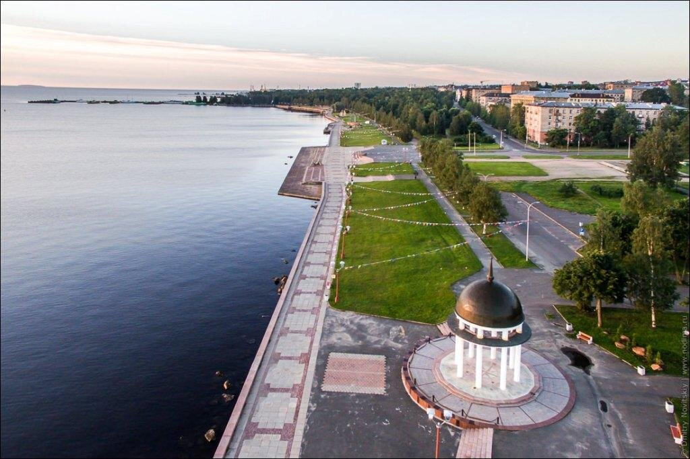

# Бочагова Виктория ИПсп-121 Индивидуальное задание Вариант 2
1. Формула вычисления площади круга.

 $S = \pi R^2$

 2. Диаграмма классов с mermaid для простой системы.



3. Форма HTML для отправки комментариев.

<html>
<body>
<h2>Оставить комментарий</h2>
<form action="add_comment.php" method="POST">
  <br><br>
  <label>Комментарий:</label><br>
  <textarea name="comment" rows="5" required></textarea>

  <input type="submit" value="Отправить комментарий">
</form>
</body>
</html>

4. Таблица с выравниванием текста со списком студентов.

| 1 | 2 | 3 | 4 | 5 |
| :-: | :-: | :-: | :-: | :-: |
| Иванов Иван | Петров Петр | Иванова Екатерина | Яргин Олег | Ключникова Елизавета |

5. Галерея изображения из трёх фото городов.




6. Список, план проекта с подзадачами.

Проект: [Домашняя работа]
 1. Подготовка
    - Собрать информацию:
        - Изучить требования к проекту.
        - Собрать данные для анализа.
        - Определить целевую аудиторию.
    - Выбрать инструменты:
         - Выбрать язык программирования.
         - Выбрать фреймворк/библиотеки.
         - Выбрать систему контроля версий (Git).
   - Создать проект:
        - Настроить рабочую среду.
        - Создать репозиторий.
        - Создать структуру проекта.
 2. Разработка
    - Реализовать функционал:
        - Разработать основные компоненты.
        - Реализовать работу с API.
        - Написать unit-тесты.
    - Дизайн:
         - Определить дизайн-концепцию.
         - Создать макеты интерфейса.
         - Разработать стили.
   - Тестирование:
        - Провести юнит-тестирование.
        - Провести ручное тестирование.
        - Провести тестирование производительности.
 3. Подготовка
    - Защита:
        - Подготовить презентацию проекта.
        - Провести демонстрацию проекта.
        - Успешно защитить проект.
<!-- -->
7. Блоки кода на Java и C++.

```java
public class Main {
    public static void main(String[] args) {
        System.out.println("Hello, World!");
    }
}
```

```C++
int main() {
    std::cout << "Hello, World!" << std::endl;
    return 0;
}
```
8. Цитата Стива Джобса.

>Качество важнее количества. Лучше точное попадание, чем жалкое добивание цели.

9. Таблица содержания.


10. Эмодзи для обозначения важной информации.

:exclamation: